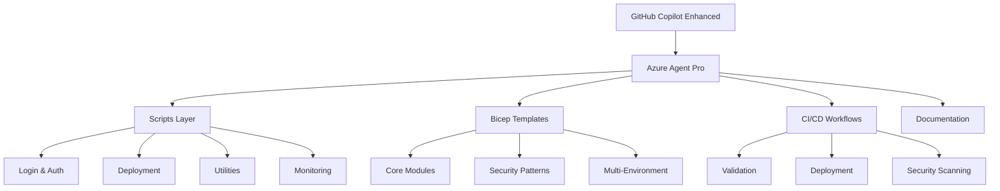

# 🚀 Azure Agent Pro

[](https://github.com/alejandrolmeida/azure-agent-pro/actions/workflows/bicep-validation.yml)
[](https://github.com/alejandrolmeida/azure-agent-pro/actions/workflows/code-quality.yml)
[](https://github.com/alejandrolmeida/azure-agent-pro/actions/workflows/deploy-azure.yml)
[](https://opensource.org/licenses/MIT)
[](https://docs.microsoft.com/en-us/cli/azure/)
[](https://docs.microsoft.com/en-us/azure/azure-resource-manager/bicep/)
[](https://github.com/features/copilot)
[](#)
[](CONTRIBUTING.md)

> **Proyecto de Investigación Educativo**: Enseñando a desarrolladores y administradores de IT cómo usar GitHub Copilot con mejoras profesionales para gestionar suscripciones de Azure como un experto.

## 🎯 Propósito del Proyecto

**Azure Agent Pro** es un proyecto de investigación educativo diseñado para demostrar y enseñar cómo GitHub Copilot puede ser potenciado con configuraciones avanzadas, scripts personalizados y workflows automatizados para gestionar infraestructura de Azure de manera profesional.

### 🎓 ¿Qué Aprenderás?

- **🤖 GitHub Copilot Avanzado**: Configuraciones y prompts optimizados para Azure
- **☁️ Azure Professional**: Mejores prácticas de gestión de suscripciones enterprise
- **🏗️ Infrastructure as Code**: Bicep templates con patterns avanzados
- **🔄 DevOps Automation**: CI/CD pipelines para múltiples ambientes
- **🔒 Security First**: Implementación de seguridad desde el diseño
- **📊 Monitoring & Governance**: Herramientas de observabilidad y compliance

### 👥 Audiencia Objetivo

- **Desarrolladores** que quieren dominar Azure con AI
- **Administradores IT** buscando automatización profesional
- **DevOps Engineers** interesados en workflows avanzados
- **Arquitectos Cloud** que necesitan patterns enterprise
- **Estudiantes** aprendiendo tecnologías cloud modernas

## 🏗️ Arquitectura del Proyecto

Azure Agent Pro está estructurado en capas para maximizar la reutilización y facilitar el aprendizaje:



## 📁 Estructura del Proyecto

```
azure-agent-pro/
├── 🤖 .github/
│   ├── chatmodes/                  # GitHub Copilot enhanced configurations
│   │   ├── azure-infrastructure-agent.md
│   │   ├── azure-devops-pipeline-agent.md
│   │   └── azure-security-agent.md
│   ├── workflows/                  # CI/CD Automation
│   │   ├── bicep-validation.yml    # Infrastructure validation
│   │   ├── deploy-azure.yml        # Multi-environment deployment
│   │   └── code-quality.yml        # Security & quality checks
│   ├── ISSUE_TEMPLATE/            # Structured issue templates
│   └── CODEOWNERS                 # Automated code review assignments
├── 🛠️ scripts/
│   ├── login/
│   │   └── azure-login.sh          # Enhanced authentication with MCP
│   ├── deploy/
│   │   └── bicep-deploy.sh         # Professional deployment automation
│   ├── config/
│   │   └── azure-config.sh         # Enterprise configuration management
│   ├── utils/
│   │   ├── azure-utils.sh          # Advanced Azure CLI utilities
│   │   └── bicep-utils.sh          # Bicep development helpers
│   ├── setup/
│   │   └── mcp-setup.sh            # Model Context Protocol integration
│   └── monitoring/
│       └── azure-monitor.sh        # Infrastructure monitoring
├── ☁️ bicep/
│   ├── main.bicep                  # Main infrastructure template
│   ├── modules/                    # Reusable infrastructure components
│   │   ├── storage-account.bicep   # Secure storage configuration
│   │   ├── virtual-network.bicep   # Network security patterns
│   │   ├── key-vault.bicep         # Secrets management
│   │   ├── app-service.bicep       # Application hosting
│   │   └── monitoring.bicep        # Observability stack
│   └── parameters/                 # Environment-specific configurations
│       ├── dev.parameters.json     # Development environment
│       ├── test.parameters.json    # Testing environment
│       ├── stage.parameters.json   # Staging environment
│       └── prod.parameters.json    # Production environment
├── 📚 docs/
│   ├── learning-paths/             # Educational content
│   │   ├── github-copilot-azure.md
│   │   ├── azure-professional-management.md
│   │   └── bicep-best-practices.md
│   ├── tutorials/                  # Step-by-step guides
│   │   ├── ai-enhanced-azure-development.md
│   │   ├── setup-development-environment.md
│   │   └── monitoring-and-troubleshooting.md
│   └── cheatsheets/                # Quick reference guides
│       ├── azure-cli-cheatsheet.md
│       ├── bicep-cheatsheet.md
│       └── mcp-servers-cheatsheet.md
├── 🔧 .vscode/                     # VS Code optimizations
│   ├── settings.json               # Optimized settings for Azure development
│   ├── extensions.json             # Recommended extensions
│   └── bicep.code-snippets         # Custom Bicep snippets
├── 🔧 scripts/                     # Automation scripts
│   ├── deploy/
│   │   └── bicep-deploy.sh         # Deployment automation
│   ├── utils/
│   │   ├── azure-utils.sh          # Azure utilities
│   │   └── bicep-utils.sh          # Bicep utilities
│   ├── setup/
│   │   └── mcp-setup.sh            # MCP servers configuration
│   └── update/
│       └── project-updater.sh      # Project updater
├── 🏗️ bicep/                      # Infrastructure as Code
│   ├── main.bicep                  # Main template
│   ├── modules/                    # Bicep modules
│   │   ├── storage-account.bicep   # Storage Account
│   │   ├── virtual-network.bicep   # Virtual Network
│   │   └── key-vault.bicep         # Key Vault
│   └── parameters/
│       ├── dev.parameters.json     # Development parameters
│       └── prod.parameters.json    # Production parameters
├── 🤖 .github/
│   ├── workflows/                  # CI/CD workflows
│   ├── chatmodes/                  # GitHub Copilot chat modes
│   │   ├── azure-infrastructure-agent.md
│   │   └── azure-devops-pipeline-agent.md
│   └── ISSUE_TEMPLATE/             # Issue templates
├── PROJECT_CONTEXT.md              # Research project context
├── LEARNING_OBJECTIVES.md          # Educational goals and outcomes
└── README.md                       # This file
```

## 🚀 Inicio Rápido

### 1. Configuración Inicial

Ejecuta el script de login para autenticarte con Azure:

```bash
cd scripts/login
./azure-login.sh
```

Este script:
- Verifica que Azure CLI esté instalado
- Realiza el login a Azure
- Te permite seleccionar la suscripción
- Guarda la configuración en `config/azure-config.env`

### 2. Verificar Configuración

```bash
cd scripts/config
./azure-config.sh
```

### 3. Desplegar Plantillas Bicep

```bash
cd scripts/deploy

# Validar una plantilla
./bicep-deploy.sh validate ../../bicep/main.bicep

# Desplegar la plantilla principal
./bicep-deploy.sh deploy ../../bicep/main.bicep my-resource-group my-deployment ../../bicep/parameters/dev.parameters.json
```

## 📋 Scripts Disponibles

### `scripts/login/azure-login.sh`

Script principal para autenticación con Azure CLI.

**Opciones:**
- Sin parámetros: Login completo y configuración
- `-s, --subscription`: Solo seleccionar suscripción
- `-i, --info`: Mostrar información de la cuenta
- `-c, --config`: Solo guardar configuración
- `-h, --help`: Mostrar ayuda

**Ejemplos:**
```bash
./azure-login.sh                    # Login completo
./azure-login.sh -s                 # Solo cambiar suscripción
./azure-login.sh -i                 # Mostrar información actual
```

### `scripts/config/azure-config.sh`

Gestión de configuración y variables de entorno.

**Opciones:**
- Sin parámetros: Cargar y validar configuración
- `-l, --locations`: Listar ubicaciones disponibles
- `-s, --status`: Mostrar estado actual
- `-v, --validate`: Validar configuración
- `--set-location <ubicacion>`: Establecer ubicación por defecto

**Ejemplos:**
```bash
./azure-config.sh                   # Cargar configuración
./azure-config.sh -l                # Listar ubicaciones
./azure-config.sh --set-location westeurope
```

### `scripts/deploy/bicep-deploy.sh`

Deployment y gestión de plantillas Bicep.

**Comandos:**
- `validate <template> [parameters]`: Validar plantilla
- `deploy <template> <rg> [name] [params] [mode]`: Realizar deployment
- `list [resource-group]`: Listar deployments
- `delete <resource-group> <name>`: Eliminar deployment
- `gen-params <template> [output]`: Generar plantilla de parámetros

**Ejemplos:**
```bash
./bicep-deploy.sh validate ../../bicep/templates/storage-account.bicep
./bicep-deploy.sh deploy ../../bicep/main.bicep my-rg storage-deploy ../../bicep/parameters/dev.parameters.json
./bicep-deploy.sh list my-rg
```

## 🏗️ Plantillas Bicep

### Plantilla Principal (`bicep/main.bicep`)

Plantilla que orquesta múltiples recursos:
- Storage Account
- Virtual Network con subredes
- Key Vault

### Plantillas Disponibles

1. **Storage Account** (`bicep/templates/storage-account.bicep`)
   - Configuración segura por defecto
   - Soporte para diferentes SKUs
   - Contenedor por defecto

2. **Virtual Network** (`bicep/templates/virtual-network.bicep`)
   - Múltiples subredes configurables
   - Network Security Groups automáticos
   - Route Tables opcionales

3. **Key Vault** (`bicep/modules/key-vault.bicep`)
   - Configuración de seguridad avanzada
   - Soft delete habilitado
   - Logging de auditoría

### Archivos de Parámetros

- `bicep/parameters/dev.parameters.json`: Configuración para desarrollo
- `bicep/parameters/prod.parameters.json`: Configuración para producción

## 🔧 Configuración

### Variables de Entorno

El archivo `config/azure-config.env` contiene:

```bash
export AZURE_SUBSCRIPTION_ID="..."
export AZURE_SUBSCRIPTION_NAME="..."
export AZURE_TENANT_ID="..."
export AZURE_USER="..."
export AZURE_LOCATION="eastus"
export AZURE_RESOURCE_GROUP_PREFIX="rg"
export AZURE_TAG_ENVIRONMENT="dev"
export AZURE_TAG_PROJECT="azure-agent"
```

Para cargar las variables:
```bash
source config/azure-config.env
```

## 📚 Recursos Adicionales

### Documentación de Azure

- [Azure CLI Documentation](https://docs.microsoft.com/en-us/cli/azure/)
- [Bicep Documentation](https://docs.microsoft.com/en-us/azure/azure-resource-manager/bicep/)
- [Azure Resource Manager](https://docs.microsoft.com/en-us/azure/azure-resource-manager/)

### Mejores Prácticas

1. **Seguridad**
   - Usa Key Vault para secretos
   - Habilita Network Security Groups
   - Configura políticas de acceso restrictivas

2. **Naming Conventions**
   - Usa prefijos consistentes
   - Incluye el entorno en el nombre
   - Mantén nombres únicos globalmente

3. **Tagging**
   - Etiqueta todos los recursos
   - Incluye información de costo y propiedad
   - Usa tags para automatización

## 🐛 Solución de Problemas

### Error: Azure CLI no encontrado
```bash
# Instalar Azure CLI en Ubuntu/Debian
curl -sL https://aka.ms/InstallAzureCLIDeb | sudo bash

# Instalar en macOS
brew install azure-cli
```

### Error: Bicep CLI no encontrado
```bash
az bicep install
```

### Error: Permisos insuficientes
Verifica que tu cuenta tenga los permisos necesarios:
- Contributor o Owner en la suscripción
- User Access Administrator para Key Vault

## 🚀 GitHub Integration y CI/CD

Este proyecto está completamente optimizado para GitHub con workflows automatizados y mejores prácticas de DevOps.

### 🔄 Workflows Automatizados

#### Bicep Validation (`bicep-validation.yml`)
- ✅ **Trigger**: Push/PR a `main` y `develop` con cambios en `bicep/`
- 🔍 **Validaciones**: Linting, sintaxis, what-if analysis, security checks
- � **Testing**: Deploy automático a ambiente de testing en PRs
- 📦 **Artifacts**: Templates compilados disponibles por 30 días

#### Deploy to Azure (`deploy-azure.yml`)
- ✅ **Trigger**: Push a `main` (auto-deploy dev) y workflow manual
- 🌍 **Ambientes**: dev, test, stage, prod con protecciones específicas
- 🔒 **Seguridad**: OIDC authentication, confirmación requerida para prod
- 📊 **Monitoring**: Outputs de deployment y tagging automático

#### Code Quality (`code-quality.yml`)
- ✅ **Trigger**: Push/PR + schedule semanal
- 🛡️ **Security**: Trivy scanning, credential detection, Bicep security
- 📝 **Quality**: ShellCheck, Markdown linting, dependency review
- 🔍 **Analysis**: SARIF upload para GitHub Security tab

### 🛡️ Branch Protection

La rama `main` está protegida con:
- ✅ **Required reviews**: 1 aprobación mínima
- ✅ **Status checks**: Todos los workflows deben pasar
- ✅ **CODEOWNERS**: Reviews automáticos por área de expertise
- ❌ **Force push**: Deshabilitado
- ❌ **Delete branch**: Deshabilitado

### 🎯 GitHub Features Habilitadas

- 🔒 **Security**: Dependency graph, Dependabot, secret scanning
- 📊 **Insights**: Code frequency, contributor stats, traffic analytics
- 🏷️ **Labels**: Sistema organizado para issues y PRs
- 📝 **Templates**: Issues específicos (bug, feature, docs, azure)
- 📋 **Project boards**: Para tracking de roadmap y sprints

### �🤝 Contribución con GitHub

¡Las contribuciones son bienvenidas! Por favor lee nuestra [guía de contribución](CONTRIBUTING.md).

#### Quick Start para Contributors

1. **Fork y clone**
   ```bash
   git clone https://github.com/tu-usuario/azure-agent.git
   cd azure-agent
   ```

2. **Configurar upstream**
   ```bash
   git remote add upstream https://github.com/alejandrolmeida/azure-agent.git
   ```

3. **Crear feature branch**
   ```bash
   git checkout -b feature/mi-mejora
   ```

4. **Hacer cambios y push**
   ```bash
   git add .
   git commit -m "feat: descripción del cambio"
   git push origin feature/mi-mejora
   ```

5. **Crear Pull Request** usando la plantilla automática

#### Tipos de Contribuciones

- 🐛 **Bug fixes**: Usa template de bug report
- ✨ **Features**: Usa template de feature request  
- 📚 **Docs**: Usa template de documentation
- 🔧 **Azure/Bicep**: Usa template específico de Azure
- 🔒 **Security**: Revisa nuestra [política de seguridad](SECURITY.md)

### 📈 GitHub Actions Secrets

Para contribuir con workflows, necesitarás configurar estos secrets:

```bash
# Required for Azure deployments
AZURE_CLIENT_ID         # Service Principal ID para OIDC
AZURE_TENANT_ID          # Azure AD Tenant ID
AZURE_SUBSCRIPTION_ID    # Target subscription ID

# Optional for notifications
SLACK_WEBHOOK_URL        # Para notificaciones de deployment
TEAMS_WEBHOOK_URL        # Para notificaciones de deployment
```

## 🤝 Contribución

¡Las contribuciones son bienvenidas! Por favor sigue estos pasos:

1. Lee nuestra [guía de contribución](CONTRIBUTING.md) 📚
2. Revisa los [issues abiertos](https://github.com/alejandrolmeida/azure-agent/issues) 🔍
3. Fork el proyecto 🍴
4. Crea una rama para tu feature (`git checkout -b feature/AmazingFeature`)
5. Commit tus cambios (`git commit -m 'feat: Add some AmazingFeature'`)
6. Push a la rama (`git push origin feature/AmazingFeature`)
7. Abre un Pull Request usando la plantilla 📝

### 🏷️ Convenciones de Commits

Usamos [Conventional Commits](https://www.conventionalcommits.org/):
- `feat:` Nueva funcionalidad
- `fix:` Corrección de bug  
- `docs:` Cambios en documentación
- `style:` Cambios de formato
- `refactor:` Refactoring de código
- `test:` Añadir o corregir tests
- `chore:` Tareas de mantenimiento

## 📄 Licencia

Este proyecto está bajo la Licencia MIT. Ver el archivo `LICENSE` para más detalles.

## 👥 Autores

- **Alejandro López Meida** ([@Alejandrolmeida](https://github.com/Alejandrolmeida)) - Creador y desarrollador principal

## 🙏 Agradecimientos

- Documentación oficial de Azure
- Comunidad de Azure Bicep
- Ejemplos de Microsoft Azure