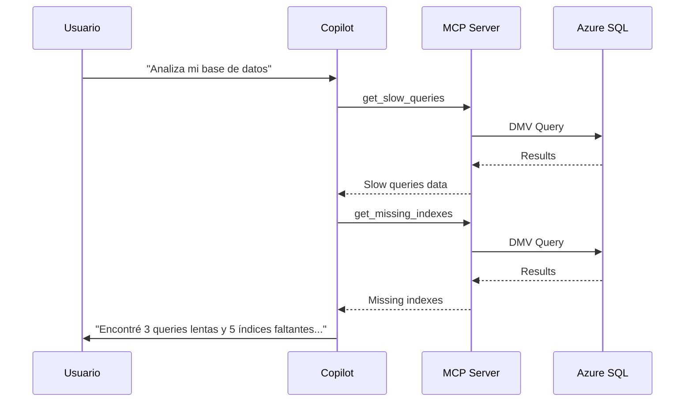

# Azure SQL MCP Server

Servidor MCP (Model Context Protocol) para ejecutar consultas SQL y análisis de rendimiento en Azure SQL Database directamente desde GitHub Copilot.

## 🎯 Características

- ✅ **Ejecutar consultas SQL** con autenticación Azure AD
- ✅ **Análisis de rendimiento** con planes de ejecución
- ✅ **Detectar queries lentas** (últimas 24 horas)
- ✅ **Identificar índices faltantes** con impacto estimado
- ✅ **Detectar bloqueos** en tiempo real
- ✅ **Integración directa con Copilot** - sin necesidad de terminal

## 🚀 Instalación

### 1. Instalar dependencias

```bash
cd mcp-servers/azure-sql
npm install
npm run build
```

### 2. Configurar variables de entorno

Copia el archivo de ejemplo:

```bash
cp .env.example .env
```

Edita `.env` con tus valores:

```bash
AZURE_SQL_SERVER=myserver
AZURE_SQL_DATABASE=mydb
AZURE_SQL_AUTH_TYPE=azure-ad
```

### 3. El servidor ya está registrado en `mcp.json`

El servidor está pre-configurado y se iniciará automáticamente cuando Copilot necesite acceder a SQL.

## 🔐 Autenticación

### Opción 1: Azure AD (Recomendado)

```bash
# Asegúrate de estar autenticado
az login

# El servidor usará tus credenciales automáticamente
```

### Opción 2: SQL Authentication

```bash
# En .env
AZURE_SQL_AUTH_TYPE=sql
AZURE_SQL_USERNAME=sqladmin
AZURE_SQL_PASSWORD=YourPassword123!
```

## 🛠️ Herramientas Disponibles

### 1. execute_sql_query

Ejecuta cualquier consulta SQL.

**Parámetros:**
- `query` (string, requerido): Consulta SQL
- `timeout` (number, opcional): Timeout en segundos (default: 30)

**Ejemplo de uso con Copilot:**
```
Usuario: "Muéstrame los 10 usuarios más recientes"

Copilot ejecutará:
Tool: execute_sql_query
Query: SELECT TOP 10 * FROM Users ORDER BY CreatedDate DESC
```

### 2. analyze_query_performance

Analiza el rendimiento de una query con plan de ejecución.

**Parámetros:**
- `query` (string, requerido): Consulta SQL a analizar

**Ejemplo:**
```
Usuario: "Analiza esta query: SELECT * FROM Orders WHERE Date > '2024-01-01'"

Copilot ejecutará:
Tool: analyze_query_performance
Query: SELECT * FROM Orders WHERE Date > '2024-01-01'

Resultado:
- Execution plan (XML)
- Statistics TIME y IO
- Recomendaciones de optimización
```

### 3. get_slow_queries

Obtiene las queries más lentas de las últimas 24 horas.

**Parámetros:**
- `topN` (number, opcional): Número de queries (default: 20)

**Ejemplo:**
```
Usuario: "¿Qué queries están siendo más lentas?"

Copilot ejecutará:
Tool: get_slow_queries
TopN: 20

Resultado:
- Execution count
- Avg CPU time
- Avg duration
- Logical reads
- Query text
```

### 4. get_missing_indexes

Identifica índices faltantes que podrían mejorar el rendimiento.

**Parámetros:**
- `minImpact` (number, opcional): Impacto mínimo (default: 10)

**Ejemplo:**
```
Usuario: "¿Qué índices me faltan?"

Copilot ejecutará:
Tool: get_missing_indexes
MinImpact: 10

Resultado:
- Improvement measure (prioridad)
- Tabla afectada
- Columnas de igualdad/desigualdad
- Columnas incluidas sugeridas
```

### 5. check_blocking_sessions

Detecta sesiones bloqueadas y queries bloqueantes.

**Ejemplo:**
```
Usuario: "¿Hay bloqueos en la base de datos?"

Copilot ejecutará:
Tool: check_blocking_sessions

Resultado:
- Session IDs (bloqueante y bloqueado)
- Wait type
- Wait duration
- Queries involucradas
```

## 📊 Casos de Uso

### Caso 1: Optimización de Performance

```
Usuario: "La aplicación va lenta, analiza el rendimiento de la base de datos"

Copilot:
1. Ejecuta get_slow_queries
2. Analiza los resultados
3. Ejecuta get_missing_indexes
4. Proporciona CREATE INDEX statements
5. Sugiere optimizaciones de queries
```

### Caso 2: Troubleshooting de Bloqueos

```
Usuario: "Los usuarios reportan timeouts"

Copilot:
1. Ejecuta check_blocking_sessions
2. Identifica la query bloqueante
3. Analiza el código con analyze_query_performance
4. Sugiere soluciones (índices, hints, isolation levels)
```

### Caso 3: Análisis de Datos

```
Usuario: "¿Cuántos pedidos tenemos por estado?"

Copilot:
1. Ejecuta execute_sql_query con:
   SELECT Status, COUNT(*) as Total FROM Orders GROUP BY Status
2. Presenta los resultados
3. Puede generar visualizaciones o insights
```

## 🔄 Workflow Completo



## 🆚 Diferencia con Scripts Bash

| Aspecto | Scripts Bash (sql-query.sh) | MCP Server |
|---------|---------------------------|------------|
| **Integración** | Manual en terminal | Automática con Copilot |
| **Conversación** | No | Sí, contextual |
| **Multi-step** | Requiere múltiples comandos | Todo en una conversación |
| **Análisis** | Usuario interpreta | Copilot interpreta y sugiere |
| **Formato** | Terminal text | JSON estructurado |

## 🔧 Desarrollo

### Compilar

```bash
npm run build
```

### Desarrollo con watch

```bash
npm run watch
```

### Probar manualmente

```bash
# Configurar variables de entorno
export AZURE_SQL_SERVER=myserver
export AZURE_SQL_DATABASE=mydb
export AZURE_SQL_AUTH_TYPE=azure-ad

# Ejecutar
npm start
```

### Agregar nueva herramienta

1. Añade la función en `src/index.ts`
2. Registra el tool en el array `tools`
3. Añade el case en el handler `CallToolRequestSchema`
4. Recompila: `npm run build`

## 🐛 Troubleshooting

### Error: "AZURE_SQL_SERVER must be set"

Verifica que las variables de entorno estén configuradas en `.env` y en `mcp.json`.

### Error: "Login failed for user"

Si usas Azure AD auth, asegúrate de:
```bash
az login
az account show
```

Si usas SQL auth, verifica usuario/password en `.env`.

### Error: "Connection timeout"

- Verifica que el firewall de Azure SQL permita tu IP
- Si estás detrás de un proxy, configúralo

### El servidor no aparece en Copilot

1. Verifica que `mcp.json` esté en la raíz del workspace
2. Recompila el servidor: `npm run build`
3. Reinicia VS Code
4. Verifica logs en Output > MCP

## 📚 Referencias

- [Model Context Protocol](https://modelcontextprotocol.io/)
- [Azure SQL Database](https://docs.microsoft.com/azure/sql-database/)
- [mssql Node.js Driver](https://www.npmjs.com/package/mssql)
- [Azure Identity](https://www.npmjs.com/package/@azure/identity)

## 🤝 Contribuir

1. Fork el proyecto
2. Crea un branch: `git checkout -b feature/nueva-herramienta`
3. Commit: `git commit -am 'Add nueva herramienta'`
4. Push: `git push origin feature/nueva-herramienta`
5. Pull Request

## 📄 Licencia

MIT License - Ver [LICENSE](../../LICENSE)
